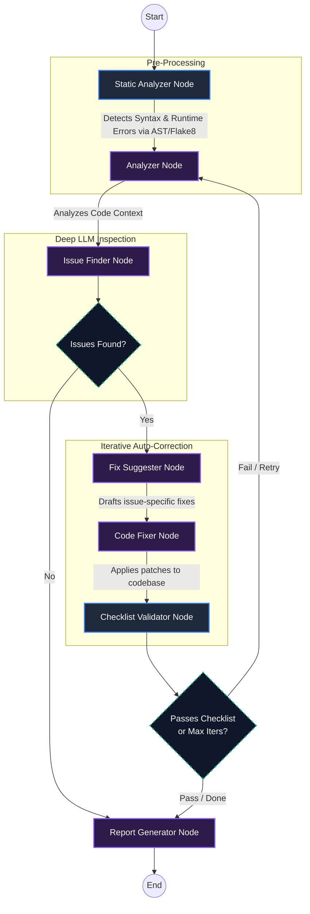

# Iterative Code Review Bot 🤖

A **stateful AI agent** that reviews Python code, identifies bugs and style violations, suggests fixes, and **re-reviews the corrected code** until it passes a quality checklist.

Built with **LangGraph** + **Google Gemini**.

## 🏗️ System Architecture & System Design (C11)

The application follows a modular, stateful graph architecture orchestrated by **LangGraph**. It employs a multi-agent workflow where deterministic tools (Static Analyzers) run before LLMs (Gemini/Groq) to eliminate hallucinations and drastically improve accuracy over standard zero-shot LLM prompts.



## 📦 Setup & Installation Guide (C10)

Setting up the Iterative Code Review Bot for local development requires Python 3.10+ and an API Key.

### 1. Prerequisites
- **Python:** `3.10` or higher is required.
- **Git:** Ensure you have cloned the repository locally.

### 2. Install Dependencies
Navigate to the root directory and install the required packages:

```bash
cd code-review-bot
pip install -r requirements.txt
```
*(Dependencies include `langgraph`, `streamlit`, `langchain-google-genai`, `requests`, and `flake8` for static parsing.)*

### 3. Configure API Credentials
The bot relies on External LLM APIs for the core reasoning steps. You must create a `.env` file in the root directory.

1. Create a `.env` file:
   ```bash
   touch .env
   ```
2. Open the `.env` file and define your chosen LLM Provider. We natively support Google Gemini (High Intelligence), Groq (Ultra Fast/Free), or Ollama (Local/Private).
   ```env
   # Choose your provider
   LLM_PROVIDER=groq

   # If using Groq (Recommended for free/fast inferences):
   GROQ_API_KEY=your_groq_api_key_here
   GROQ_MODEL=llama-3.3-70b-versatile

   # If using Google Gemini:
   GOOGLE_API_KEY=your_gemini_api_key_here
   ```
   > 🔑 **Get API Keys:** [Groq Console](https://console.groq.com/keys) | [Google AI Studio](https://aistudio.google.com/apikey)


## 🚀 Usage

### CLI Mode

```bash
# Review a file
python main.py path/to/your_code.py

# Review inline code
python main.py --code "def hello(): print('hi')"

# Interactive mode
python main.py
```

### Web UI (Streamlit)

```bash
streamlit run app.py
```

## 📊 Evaluation & Metrics (C8, C9)

We evaluate the bot's deterministic accuracy and LLM hallucination rates programmatically. 

### Running the Evaluation Framework
You can benchmark the bot against a standardized set of buggy and clean scripts to measure True Positives (bugs caught) and False Positives (hallucinations).

```bash
python evaluate_bot.py
```

### Result Interpretation
The script calculates an `Accuracy Score` based on precision and recall.
- **High Score (>90/100):** The Static Analyzer successfully preempted the LLM, catching 100% of syntax errors, while the strict LLM prompts successfully avoided hallucinating any false positives on `clean_code.py`.
- **Low Score (<70/100):** The LLM is likely misattributing style warnings as critical bugs, representing False Positives.

## 📁 Project Structure

```
code-review-bot/
├── src/
│   ├── state.py              # Graph state definition
│   ├── graph.py              # LangGraph workflow
│   ├── prompts.py            # LLM prompt templates
│   ├── checklist_config.py   # Quality checklist
│   └── nodes/
│       ├── analyzer.py       # Code analysis
│       ├── issue_finder.py   # Issue extraction
│       ├── fix_suggester.py  # Fix suggestions
│       ├── code_fixer.py     # Code correction
│       ├── checklist.py      # Checklist validation
│       └── report_generator.py
├── main.py                   # CLI entry point
├── app.py                    # Streamlit web UI
└── tests/
    └── sample_code/
        ├── buggy_code.py     # Test with intentional bugs
        └── clean_code.py     # Test with clean code
```

## ✅ Quality Checklist

The bot validates code against these items:
1. PEP 8 naming conventions
2. Docstrings for functions/classes
3. No dangerous functions (eval/exec)
4. Proper error handling
5. No mutable default arguments
6. No unused imports
7. Type hints present
8. No hardcoded secrets
9. No magic numbers
10. Single responsibility principle

## 🔧 Tech Stack

| Technology | Purpose |
|---|---|
| LangGraph | Stateful workflow orchestration |
| Google Gemini | LLM-powered code analysis |
| Streamlit | Web UI |
| Python | Core language |
